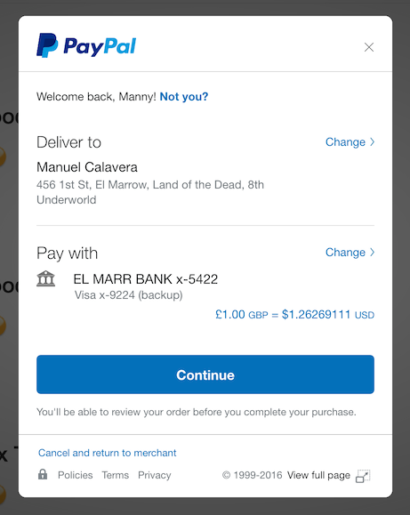

PayPal Checkout Components
--------------------------

A set of components allowing easy integration of PayPal Buttons and PayPal Checkout into your site, powered by
[xcomponent](https://github.com/krakenjs/xcomponent).

These components support various levels of integration, depending on your requirements:

- A simple PayPal Button which takes your customer through the payment process end-to-end
- An advanced PayPal Button which allows you to use [PayPal Payments REST API](https://developer.paypal.com/docs/api/payments/) to accept and process payments
- Stand-alone PayPal Checkout, if you have your own pre-existing checkout button

We also support native React, Angular and Ember components for the PayPal Button.

### Which Integration is right for me?

- Do you want the **simplest possible PayPal Integration**? If so, you should stick with the **Simple PayPal Checkout Button**
  using a **Script Element** which allows you to just drop a button straight into your page. This will allow your customer
  to pay with PayPal, and we'll notify you when they're done.

- Do you use **React.js, Angular.js or Ember.js** to render your page? If so, you should use the **React.js, Angular.js or Ember.js Elements**,
  which provide native support for each of these frameworks, so you can drop PayPal Buttons in any of your front-end views.

- Do you **have your own checkout button** and you only want to use the PayPal Checkout flow? If so you
  should use the **PayPal Checkout** component, which opens up the PayPal Checkout flow on-demand, when you decide.

- Do you need **finely grained control** over your transaction; creating and finalizing transactions from your server
  side using PayPal's REST api? If so you should use the **Advanced Javascript Integration**, which will allow you to create
  and finalize the transaction yourself on your server side using the [PayPal Payments REST API](https://developer.paypal.com/docs/api/payments/).
  Then you can just use the **PayPal Button** or **PayPal Checkout** components to get the customer's approval for the payment,
  and do everything else on your server side.

## Usage

1. Add `checkout.v4.js` to your page:

   ```html
   <script src="https://www.paypalobjects.com/api/paypal.checkout.v4.js"></script>
   ```

2. Drop one of the following components into your page:

## PayPal Checkout Button


This component renders a PayPal button onto your page, which will take care of opening up PayPal for you and guiding
your customer through the payment process. After the payment is complete, we will notify you using a javascript callback,
and you can take your customer to a success page.

### [Simple Javascript Button Integration](./docs/button-simple.md)

This integration lets you specify all of your payment parameters all at once, to render a button onto the page.

### [Advanced Javascript Button Integration](./docs/button-advanced.md)

This component renders a PayPal button onto your page, which will take care of opening up PayPal for you and guiding
your customer through the payment process. After the payment is complete, we will notify you using a javascript callback,
and you can take your customer to a success page.

-----

## PayPal Checkout



This component immediately opens PayPal on your page, and guides your customer through the payment process. After the
payment is complete, we will notify you using a javascript callback and you can take your customer to a success page.

**Important Note:** This component should only be used if you do not require a PayPal Button on your page. The recommended
integration is using the PayPal Button.

### [Simple Javascript Checkout Integration](./docs/checkout-simple.md)

This integration lets you specify all of your payment parameters all at once, to initialize the checkout flow.

### [Advanced Javascript Checkout Integration](./docs/checkout-advanced.md)

This component immediately opens PayPal on your page, and guides your customer through the payment process. After the
payment is complete, we will notify you using a javascript callback and you can take your customer to a success page.

-----

## Integrating with the PayPal REST API

If you want to use the advanced javascript integrations, you will need a way to create payment tokens on your
server side. The simplest way to do this is using the [PayPal Payments REST API](https://developer.paypal.com/docs/api/payments/)

### [Integrating with the PayPal REST API](./docs/paypal-rest-api.md)

## Legacy Integrations

All of the [legacy integration patterns](https://developer.paypal.com/docs/classic/express-checkout/in-context/integration/)
for PayPal Checkout will continue to work with this script.
