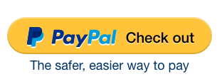

## PayPal Checkout Button



This integration uses [PayPal Payments REST API](./paypal-rest-api.md), which is more useful for advanced integrations.

1. You call `ppxo.PayPalButton.render` to invoke PayPal Checkout
2. We call your `paymentToken` function, when we need a payment token
3. You call your server side, which calls [Payment Create](https://developer.paypal.com/docs/api/payments/#payment_create) to create a payment token - see [PayPal REST API](./paypal-rest-api.md)
4. When you get the token, you pass it back to us using `resolve(token)`;
5. We take the buyer through the PayPal Checkout flow to authorize the transaction
6. When we're done, we call your `onPaymentAuthorize` function
7. You then call your server side, which calls the [Payment Execute](https://developer.paypal.com/docs/api/payments/#payment_execute) api to finalize the transaction - see [PayPal REST API](./paypal-rest-api.md)
8. The payment is complete!

```javascript
ppxo.PayPalButton.render({

	// Pass your preferred locale, used to render the button (optional)

	locale: 'en_US',

	// Pass a function which will retrieve the payment token for the transaction

	paymentToken: function(resolve, reject) {

		// Make an ajax call to get the express-checkout token. This should call your back-end, which should invoke
		// the PayPal Payment Create api to retrieve the token.
		//
		// See https://developer.paypal.com/docs/api/payments/#payment_create

		jQuery.post('https://www.my-paypal-store.com/my-api/payment-create')

			// Handle the success case by passing the token to the resolve callback

			.done(function(data) {
				resolve(data.token);
			})

			// Handle the error case by passing the error to the reject callback

			.fail(function(err) {
				reject(err);
			});
	},

	// Pass a function to be called when the customer approves the payment

	onPaymentAuthorize: function(data) {

		console.log('The payment was authorized!');
		console.log('Token = ', data.paymentToken);
		console.log('PayerID = ', data.payerID);

		// At this point, the payment has been authorized, and you will need to call your back-end to complete the
		// payment. Your back-end should invoke the PayPal Payment Execute api to finalize the transaction.
		//
		// See https://developer.paypal.com/docs/api/payments/#payment_execute

		jQuery.post('https://www.my-paypal-store.com/my-api/payment-execute', { token: data.paymentToken, payerID: data.payerID });

			.done(function(data) {
				 // Go to a success page
			})

			.fail(function(err) {
				// Go to an error page
			});
	}

}, '#myContainerElement');
```
